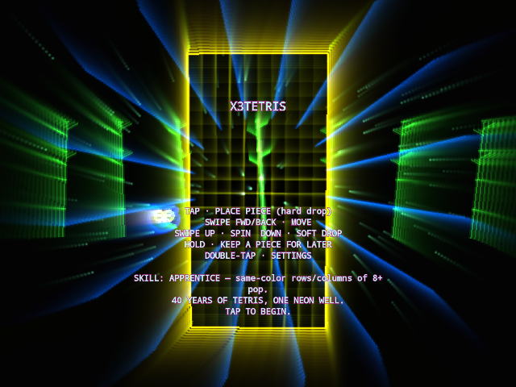
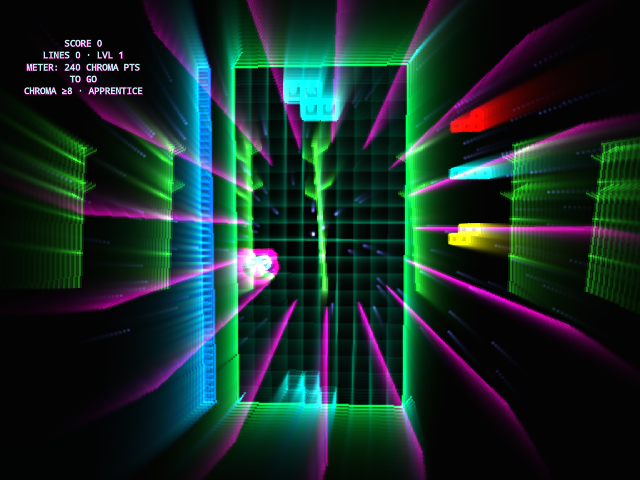

# X3Tetris

X3Tetris is a guideline-faithful Tetris built natively for the RayNeo X3 Pro AR glasses, rendered as glowing additive vector lines with video-feedback trails, hue-cycling colors, and particle bursts on every line clear. Every modern mechanic — the ghost piece, SRS rotation with wall kicks, the 7-bag randomizer, hold, T-spins, back-to-back and combo scoring — is a real piece of Tetris's 40-year history, and the game narrates that lineage as you level up through it. Progression runs on a "goal meter" rather than a flat line count, with four skill tiers (Apprentice through Wizard) that each define what fills it differently, from color-chain "chroma points" down to a strict 10-line sprint with no shortcuts.

## Screenshots

  
  

## Controls (right temple pad)

- Swipe forward / back — move piece right / left
- Swipe up — rotate (SRS, with kicks)
- Swipe down — soft drop
- Tap — hard drop (place piece)
- Double-tap — settings menu
- Long press — hold piece

## Download

[X3Tetris.apk](X3Tetris.apk)
